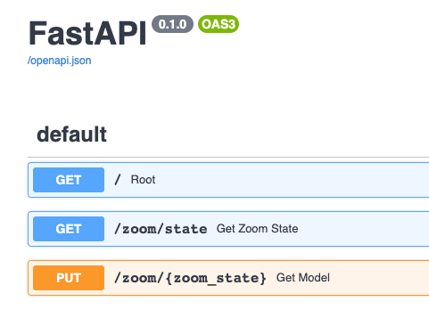

# rgb-matrix-api
Overly complicated way of using Python FastAPI/async and Redis to create an API for things like zoom mute status indication.

* When Zoom is not running/not in a meeting, you get a simple date/time display.
* When you are in a meeting and unmuted, a green 'on the air' image is displayed.
* When you are in a meeting and muted, a red 'muted' image is displayed.

# Early demo


https://www.youtube.com/watch?v=dxMZ7T-pGdI

# Future ideas
- [x] Dockerize the solution for sanity
- [ ] Text endpoints
- [x] Pre-loaded image/gif endpoints
- [ ] Other application endpoints

# Why?
I was constantly struggle-bussing to manage my Zoom mute state, and loved the idea of a coloured indicator.  My keyboard could handle the RGB and code changes, but there was no practical way to communicate over USB HID from my Mac.

I saw a bunch of ways of doing it, but the solid 'mute button hardware' seemed to have iffy software support.

I really wanted to have a monitor surround that lit up, but...I had the RGB panels and Raspberry Pi sitting around from an old work hackday project (_that I saved from the garbage, but had no hand in creating_).  So I knew it was possible, and a lot less work than going whole hog on a 3D printing project.  That is something I still want to do in future...

# Docker build, deploy, test
There is a script to build and run via Dockerfiles and `docker-compose`.
```
./run.sh
```
This does a few things in one command...
- sends the whole repo over to the Raspberry Pi
- builds the api and client docker images for local-to-the-Raspberry Pi consumption
- runs docker-compose up
- runs the tests

You end up with...

```
CONTAINER ID   IMAGE                      COMMAND                  CREATED          STATUS          PORTS                                       NAMES
3152ffe41228   rgb-matrix-client:latest   "python3 -u /code/ap…"   45 seconds ago   Up 36 seconds                                               client
e07d31609980   rgb-matrix-api:latest      "uvicorn app-api.mai…"   54 seconds ago   Up 35 seconds   0.0.0.0:8000->8000/tcp, :::8000->8000/tcp   api
8e0727bd1f0b   redis:6.2-alpine           "docker-entrypoint.s…"   57 seconds ago   Up 41 seconds   0.0.0.0:6379->6379/tcp, :::6379->6379/tcp   redis
```

# Development
The dev workflow looks like this...
- Run deploy.sh
- Have the logging open on separate terminals
- Google stuff

I used print statements to help with debugging, but deleted/disabled them to help CPU usage.

## Icon dev
There is an included FireAlpaca project file in the icons folder.  Just a bunch of layers on a 96x32 file size.

- Red 'unmuted'
- Green, 'on the air'

I think images/gifs are going to be the most effective way of achieving the UI I want...but might be tricky with a dynamic UI.
That being said, very similar to QMK's Quantum Painter (https://docs.qmk.fm/#/quantum_painter) and people have done some super cool stuff with that.

## Matrix dev
This part is trickier...I really should have built a simple matrix test app that did nothing but allow me to mess around.

This guy is a complete champ, all heavy lifting done here: https://github.com/hzeller/rpi-rgb-led-matrix

Anyways, here are some working examples of matrix code...
``` python
# working fill
matrix.Fill(100,100,100)

# working image display, sort of...it's 11 pixels short...the resize function fixed that.  weird.
# i'm exporting them at the right size...?
image = Image.open("icons/inactive.png")
resized_image = image.resize((96,32)) # forcing the resize here helps...but odd pixel results
matrix.SetImage(resized_image.convert('RGB'))

# working draw text using the graphics library
font = graphics.Font()
font.LoadFont("fonts/10x20.bdf")
colour = graphics.Color(100, 100, 100)
graphics.DrawText(matrix, font, 8, 22, colour, "INACTIVE")
```

# App architecture
- Why Python/FastAPI?  We use it at work, and I was trying to two-birds the problem.
- Why Redis?  I've used it before, and the original code for these panels used it, so familiarity.
- Why pubsub AND key-value?  Don't judge.  Learning experience.
- Why async????  I didn't know of any better way to handle multi-threading.  The RGB panels have no onboard memory/microcontroller, so they need a constant 'write LED to' stream.  The python API and pubsub/kv stuff needs to run on its own threads.  Here we are.


## API documentation
FastAPI is kinda nifty, so you can get api docs at http://localhost:8000/docs , like this:


# Mac-side setup
Swiftbar: https://github.com/swiftbar/SwiftBar

I found the script code guts here: https://dustin.lol/post/2021/better-zoom-mute/

## SwiftBar timing
Note that the filename is used by SwiftBar for timing: `zoom-mute.500ms.sh`
So if you want to adjust timing, you change the filename.

# Hardware
What I used...
- Raspberry Pi 2 (what I had on hand)
- Adafruit RGB Matrix hat
- 3x 32x32 RGB panels (what I had on hand)
- 3D printed stand/Raspberry Pi mount

This was a project of 'finish what you started' and 'use what you have', so here we are.

## Panel stand
Quick DIY job on my part...


# Raspberry Pi Setup
You are sudo installing a lot because the matrix libraries require sudo access for performance reasons.

```
curl -sSL https://get.docker.com | sh
sudo usermod -aG docker pi
docker run hello-world
sudo systemctl enable docker
sudo curl -SL https://github.com/docker/compose/releases/download/v2.11.2/docker-compose-linux-armv6 -o /usr/local/bin/docker-compose
sudo chmod +x /usr/local/bin/docker-compose
# just for debugging redis calls
echo "alias redis-cli='docker exec -it rgb-matrix-api-cache-1 redis-cli'" >> ~/.bashrc
```
## SSH access to Raspberry Pi
Don't forget to add your ssh public key to: `~/.ssh/authorized_keys`

## Setting up the RGB matrix libraries on the Raspberry Pi
This needs to be done on the Raspberry Pi, I could not get it to run on my Mac - but that could be due to work local dev enviro stuff.
```
git clone git@github.com:hzeller/rpi-rgb-led-matrix.git
cd ~/git/rpi-rgb-led-matrix/bindings/python
make build-python PYTHON=$(command -v python3)
sudo make install-python PYTHON=$(command -v python3)
```
